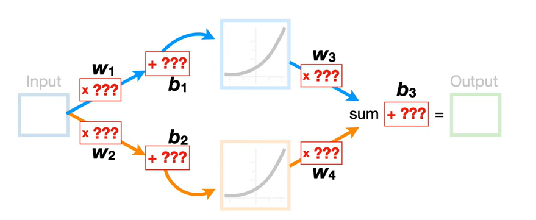
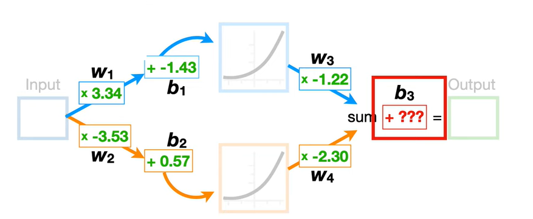
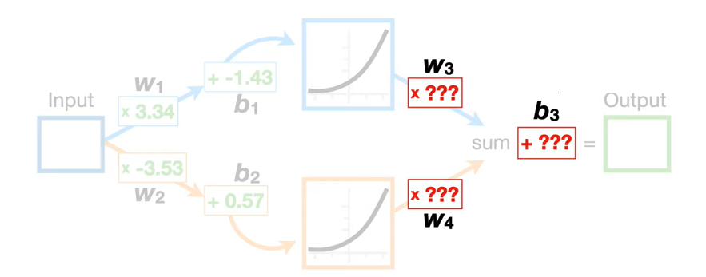

# Neural Networks

In general Neural Networks might be difficult to understand due to their complex structure but there are a few tricks in order to get ahold of what is going on within the black box

## Example

Consider the following scenario: we test the efficacy of a medicinal on serveral indiviudals based on the amount we give them (low medium high) and we observe the following distribution

fitting a strainght line to the data to make prediction will not work, but with a NN we can fit something more effective. and even in the case of more complicated data the NN can be really effective.

Lets assume for now that the best values of the NN are already determined and we just see how they work within the NN.

The NN works by summing and multiplying specific curves known as activation functions in this context. The most common examples are

* ReLU
* Heavside
* Sign
* Linear
* Piece Wise Linear
* Logistic (Sigmoid)
* Hyperbolic tangent
* Softplus
  

The idea within NN is to multiply them by coefficient and then sum them at each layer in the NN to get the best fitting for the data. In this case we will use Softmax with the following coefficients

This specific instance has one one input node, one layer made of two nodes and only one output node.

## How it Works

Lets assume that we now have an input for our NN $x_1 = 0$. we go through the branches one by one

* **Top Branch**: $x_1$ gets multiplied by $w_{11}$ (-34.4) and to the result we sum $h_11$ (2.14), lets call that $x_{11}$. Then we compute the Sofplus of that value $\ln(1+ \exp(x_{11}))$, lets call this $z_1$. $z_1$ is then the argument of the second linear transformation, we multiply that by $w_{12}$ (-1.3) and call that $z_{12}$.
 $$ 0 \cdot (-34.3) + 2.14 = 2.14 = x_{11}$$
 $$ \ln(1+ \exp(2.14)) = 2.25  = z_1$$
 $$ 2.25 \cdot (-1.3) = -2.93 = {z_12}$$

* **Bottom Branch**: we perform the same calculations only with the updated parameters
 $$ 0 \cdot (-2.52) + 1.29 = 1.29 = x_{21}$$
 $$ \ln(1+ \exp(1.29)) = 1.53  = z_2$$
 $$ 1.53 \cdot (2.28) = 3.49 = z_{22}$$

* **Last Step** we sum ${z_12} + {z_22}$ and we add the final $h$ (-0.58)
 $$-2.93 + 3.49 - 0.58 = - 0.02$$

 By letting the input $x_1$ vary we describe a function that fits the data pretty much like this one

 

 $$ f(x) = (-1.3) \cdot (\text{Softmax}(-34.4 \cdot x + 2.14)) + (2.28) \cdot (\text{Softmax}(-2.52 \cdot x + 1.29)) -0.58$$

## Back Propagation

 The process of setting the weights and biases for the NN is called back propagation. Teh basis step for understanding it is to get into the chain rule

### Chain Rule

given a function $y = f(x)$ and a function $h = g(y)$ you can write the derivative $\frac{dg}{dx}$ as

 $$\frac{dg}{dx} = \frac{dg}{dy} \cdot \frac{dy}{dx} $$

### Chain Rule and Loss Function

The loss function $L$ measures the difference between predicted values and correct values and applies to NN as well. Most of the time it is not just the residuals but rather a function of those (such as square of the residual). Given that the NN works by triggering activation functions its Loss can also be expressed in a composite form

 $$z(w,b) = w \cdot x + b \text{ expresses the linear pass that we apply to the input}$$
 $$a(z) \text{ is the activation function} $$
 $$L(a) = L(w , b) = L(a(w \cdot x + b)) \text{ is the Loss function in terms of w and b}$$

Then we can apply the chain rule to see how the Loss function changes in terms of $w,b$

 $$\frac{\partial L}{\partial w} = \frac{\partial L}{\partial a} \cdot \frac{\partial a}{\partial z} \cdot \frac{\partial z}{\partial w}$$
  $$\frac{\partial L}{\partial b} = \frac{\partial L}{\partial a} \cdot \frac{\partial a}{\partial z} \cdot \frac{\partial z}{\partial b}$$

This application unlocks the possibility to perform Gradient Descent which is the main algorothm for parameter estimation in Backpropagation.

### Gradient Descent

The process of estimating the best parameters $w,b$ for our NN is a linear regression problem, indeed we are optimizing

$$y(w,b) = w \cdot x + b$$

over and over again. Gradient Descent is a very general way to find optimization soutions.

Given a set of input values $x_1, \dots, x_k$ and the form of a generic line we can set random values for $w,b$ called $w_0$ and $b_0$. Given that set of values for each $x_i$ we calcualte the predicted value $\hat{y}_i$ and compare it with the actual value $y_i$

$$ L = \sum_{i=1}^{n} (\hat{y}_i -y_i)^2$$

the goal of GD is to find the minimum value of $L$. The best parameters for fitting will be the $w_k b_k$ associated to that $L$ function 

GD calcualtes now the derivatives of $L$ with respect to every parameter (in our simplifies case $w$ and $b$) and builds the so called gradient vector

 $$\nabla L = \left[2 \sum_{i=1}^{n} (\hat{y}i -y_i) * x_i, \quad 2 \sum_{i=1}^{n} (\hat{y}_i -y_i)\right]$$

 which looks a generic espression but is actually a vector of numbers, the update of the weights now happens through the expression

 $$
w_1 = w_0 - \alpha \frac{\partial{L}}{dw} \\
 \\ ------- \\ 
b_1 = b_0 - \alpha \frac{\partial{L}}{db}
 $$

where $\alpha$ is the learning rate of the algorithm. The algorithm continues until convergence

The general formula, given $w_0, \dots w_k = \mathbf{W}$ weights for the expression $y = w_0 + \sum_{i=1}^{k} w_i \cdot x_i$ will be

$$
\text{repeat until convergence} \\

\{ w_i := w_i - \alpha \cdot \frac{\partial L(\mathbf{W})}{\partial w_i} \\ 
\text{for every } i \text{ in } (0,k) \}
$$

### Backpropagation

back to our NN. we have seen how they work and how to make a prediction when we already have determined the best parameters. But how do we determine those parameters in the first place?

for the moment we can just focus on $b_3$ and see al the main ideas, and assume that we already have the best estimation for all parameters other than $b_3$. We will see afterwards how to generalize to multiple variables.

Plugging in the values for the input (lets assume between 0 and 1 fir simplicity) into the top and bottom branch of the nn we are able to determine partial results up to the point when we have to plug in $b_3$

 $$ 
  f(x) = w_3 \cdot \text{Softmax}(w_1 \cdot x + b_1) + w_4 \cdot \text{Softmax}(w_2 \cdot x + b_2) + b_3  = y\\
 f(x) = (-1.22) \cdot \text{Softmax}(3.34 \cdot x + -1.43)+ (-2.30) \cdot \text{Softmax}(-3.53 \cdot x + 0.57) + b_3
 $$

the first step is to give a random value to $b_3$, lets say 0. Then we evaluate the sum of the square residuals for the predictions when $b_3 = 0$. Lets consider this trivial usecase (in blue you have the observed data and in green $f(x, b_3=0)$)

$$
f(0,b_3=0) = -2.6 \\
f(0.5, b_3=0) = -1.61 \\
f(1,b_3=0) = -2.61 \\
------------\\
L= (0+2.6)^2 + (1+ 1.61)^2 + (0+2.61)^2 = 20.4
$$

we can now apply GD. we compute the derivative of $L$ with respect to $b_3$

$$
\frac{dL}{db_3} = \frac{dL}{dy} \cdot \frac{dy}{db_3} \\
\frac{dL}{dy} = -2 \sum_{i=1}^{k} \hat{y}_i -y_i \\
\frac{dy}{db_3} = 1 \\
\frac{dL}{db_3} = -2 \sum_{i=1}^{k} \hat{y}_i -y_i
$$

we can now evaluate the gradient in our case

$$
\frac{dL}{db_3} = - 2 \cdot [(0 + 2.6) + (1+1.61) + (2.61)] = -15.7
$$

and plug it in the GD equation (assume $\alpha = 0.1$)

$$
b_3 := 0 - 0.1 \cdot(-15.7) = 1.57
$$

we have substituted our random initialized $b_3$ with a new value. We now calcualte

$$
f(0,b_3=1.57) = -1.03 \\
f(0.5, b_3=1.57) = -0.03 \\
f(1,b_3=1.57) = -1.04 \\
$$

and the new Loss function accordingly. It is not a necessary step but it helps understand that $L$ gets smaller. Even better we can compute the gradient

$$
\frac{dL}{db_3} = - 2 \cdot [(0 + 1.03) + (1+0.03) + (0+1.04)] = -6.26
$$

and update $b_3$ again:
$$
b_3 := 1.57 - 0.1 \cdot(-6.26) = 2.19
$$

this will reach convergence at the optimal value of $b_3$.

LEt'S complicate the scenario and imagine that we want to optimize many params as one, namely $w_3, w_4, b_3$.

the procedure is similar. We start by initializing $w_3, w_4, b_3$ picking the first two from a uniform distribution and as we did before $b_3 = 0$. Let's say $w_3 = 0.36, w_4 =0.63, b_3=0$

 $$
  f(x) = w_3 \cdot \text{Softmax}(w_1 \cdot x + b_1) + w_4 \cdot \text{Softmax}(w_2 \cdot x + b_2) + b_3  = y\\
 f(x) = w_3 \cdot \text{Softmax}(3.34 \cdot x + -1.43)+ w_4 \cdot \text{Softmax}(-3.53 \cdot x + 0.57) + b_3
 $$

 and as we did before we compute the Loss function

$$
f(0, w_3 = 0.36, w_4=0.63,b_3=0) = 0.72 \\
f(0.5, w_3 = 0.36, w_4=0.63,b_3=0) = 0.46 \\
f(1, w_3 = 0.36, w_4=0.63,b_3=0) = 0.77 \\
------------\\
L= (0 -0.72)^2 + (1 - 0.46 )^2 + (0 - 0.77)^2 = 1.4
$$

now we apply gradient descent, and this is where stuff is slightly different. We no longer only evaluate the derivative with respect to $b_3$ but we compute the partial derivatives with resoect to $w_3, w_4, b_3$

$$
\frac{\partial L}{\partial b_3} = -2 \sum_{i=1}^{k} \hat{y}_i -y_i \\
-----\\
\frac{\partial L}{\partial w_3} =\frac{\partial}{\partial w_3} \sum_{i=1}^{n} (\hat{y}_i -  w_3 \cdot \text{Softmax}(3.34 \cdot x + -1.43)+ w_4 \cdot \text{Softmax}(-3.53 \cdot x + 0.57) + b_3 )^2\\
-----\\
\frac{\partial L}{\partial w_4} = \frac{\partial}{\partial w_4} \sum_{i=1}^{n} (\hat{y}_i -  w_3 \cdot \text{Softmax}(3.34 \cdot x_i + -1.43)+ w_4 \cdot \text{Softmax}(-3.53 \cdot x_i + 0.57) + b_3 )^2
$$

the last two are a bit ugly but can be solved using the chain rule, by calling

$$
y_{1,i} = \text{Softmax}(3.34 \cdot x_i + -1.43) \text{ because this is the output of the first node} \\
y_{2,i} = \text{Softmax}(-3.53 \cdot x_i + 0.57) \text{ because this is the output of the second node} \\
$$

then 

$$
\frac{\partial L}{\partial w_3} = \frac{\partial L}{\partial y} \cdot \frac{\partial y}{\partial w_3} = -2 \sum_{i=1}^{k} (\hat{y}_i -y_i) \cdot y_{1,i} \\
-----\\
\frac{\partial L}{\partial w_4} = \frac{\partial L}{\partial y} \cdot \frac{\partial y}{\partial w_4} = -2 \sum_{i=1}^{k} (\hat{y}_i -y_i) \cdot y_{2,i} \\
$$

and we can plug the results into gradient descent (one just needs to do the math)

$$
\frac{\partial L}{\partial w_3} = -2 \cdot \big[ (0-0.72)\cdot 0.21 + (1-0.46) \cdot 0.82 + (0-0.77) \cdot 2.04 \big] = 2.58 \\
\frac{\partial L}{\partial w_4} = 1.26 \\
\frac{\partial L}{\partial b_3} = 1.90
$$

and assuming a $\alpha = 0.1 $ we have

$$
w_3 := 0.36 -0.1 \cdot 2.58 = 0.1 \\
w_4 := 0.63 -0.1 \cdot 1.26 = 0.5 \\
b_3 := 0 -0.1 \cdot 1.90 = -0.19
$$

and we now repeat until convergence.

The general form of GD optimizes all params at once, the derivative become even more ugly and you'll have a partial derivative to compute for every weight and every bias, but the math is the same.