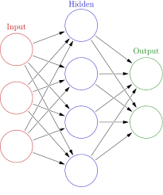
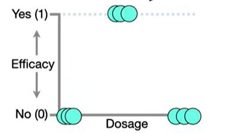
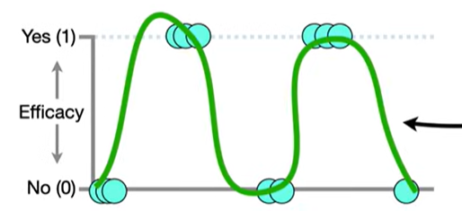
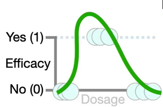

# Neural Networks

In general Neural Networks might be difficult to understand due to their complex structure but there are a few tricks in order to get ahold of what is going on within the black box

## Example

Consider the following scenario: we test the efficacy of a medicinal on serveral indiviudals based on the amount we give them (low medium high) and we observe the following distribution

fitting a strainght line to the data to make prediction will not work, but with a NN we can fit something more effective. and even in the case of more complicated data the NN can be really effective.

Lets assume for now that the best values of the NN are already determined and we just see how they work within the NN. 

The NN works by summing and multiplying specific curves known as activation functions in this context. The most common examples are

* ReLU
* Heavside
* Sign
* Linear
* Piece Wise Linear
* Logistic (Sigmoid)
* Hyperbolic tangent
* Softplus
  

The idea within NN is to multiply them by coefficient and then sum them at each layer in the NN to get the best fitting for the data. In this case we will use Softmax with the following coefficients

This specific instance has one one input node, one layer made of two nodes and only one output node.

## How it Works

Lets assume that we now have an input for our NN $x_1 = 0$. we go through the branches one by one

* **Top Branch**: $x_1$ gets multiplied by $w_{11}$ (-34.4) and to the result we sum $h_11$ (2.14), lets call that $x_{11}$. Then we compute the Sofplus of that value $\ln(1+ \exp(x_{11}))$, lets call this $z_1$. $z_1$ is then the argument of the second linear transformation, we multiply that by $w_{12}$ (-1.3) and call that $z_{12}$.
 $$ 0 \cdot (-34.3) + 2.14 = 2.14 = x_{11}$$
 $$ \ln(1+ \exp(2.14)) = 2.25  = z_1$$
 $$ 2.25 \cdot (-1.3) = -2.93 = {z_12}$$

* **Bottom Branch**: we perform the same calculations only with the updated parameters
 $$ 0 \cdot (-2.52) + 1.29 = 1.29 = x_{21}$$
 $$ \ln(1+ \exp(1.29)) = 1.53  = z_2$$
 $$ 1.53 \cdot (2.28) = 3.49 = z_{22}$$

* **Last Step** we sum ${z_12} + {z_22}$ and we add the final $h$ (-0.58)
 $$-2.93 + 3.49 - 0.58 = - 0.02$$

 By letting the input $x_1$ vary we describe a function that fits the data pretty much like this one

 

 $$ f(x) = (-1.3) \cdot (\text{Softmax}(-34.4 \cdot x + 2.14)) + (2.28) \cdot (\text{Softmax}(-2.52 \cdot x + 1.29)) -0.58